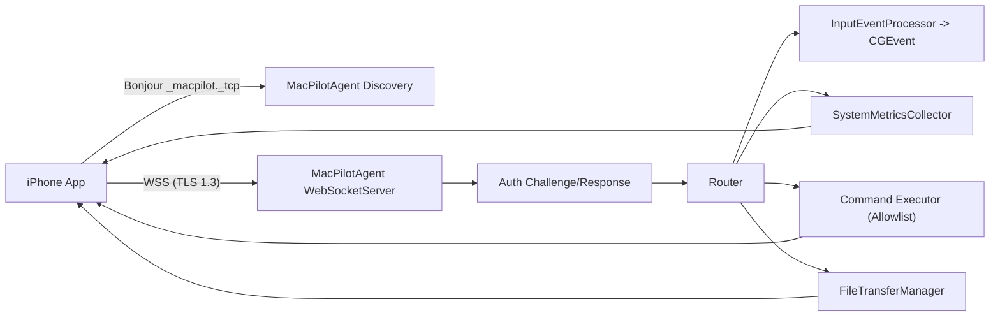
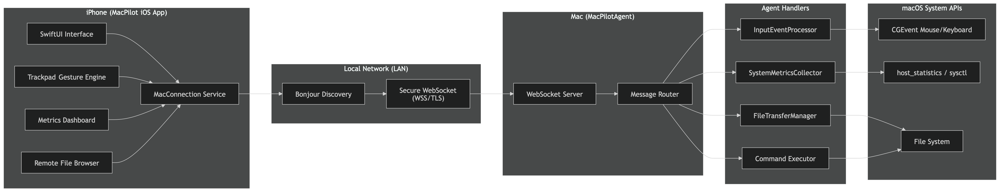
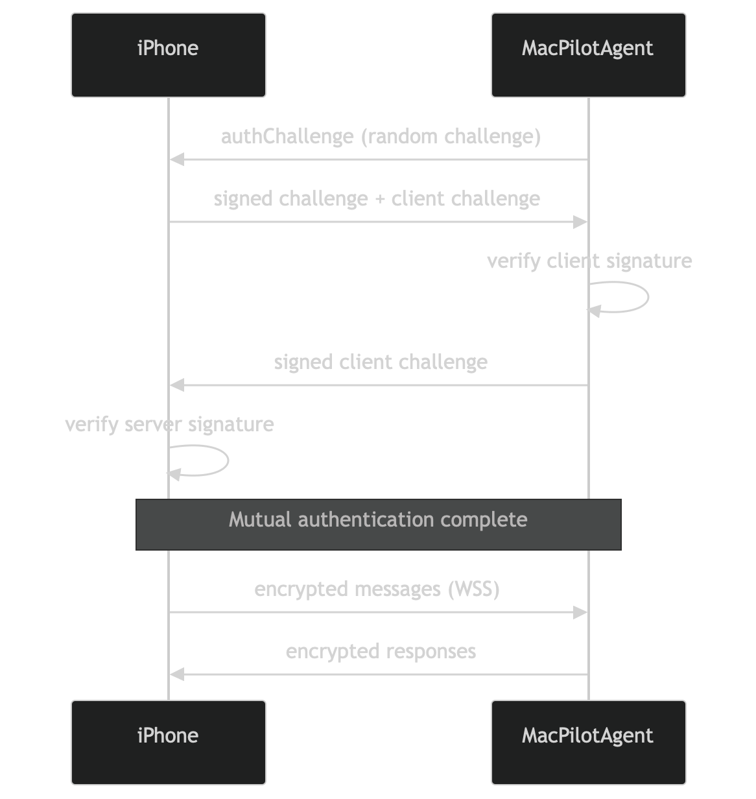
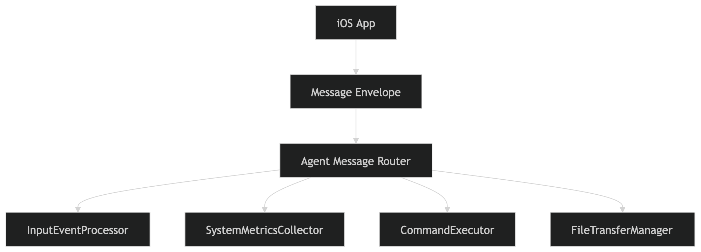
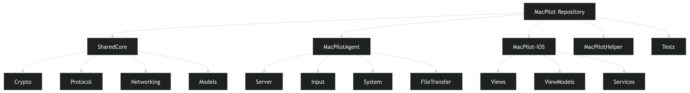

# MacPilot

Language:

- [English](#english)
- [Turkce](#turkce)

## English

MacPilot is a multi-target Apple project that lets an iPhone control and monitor a Mac over the local network.

This repository contains the **public architecture and implementation**. Private/internal security protocol documents are intentionally excluded.

## Public Scope

- Included: source code for iOS app, macOS agent, helper app, shared protocol/models, tests, and operational scripts.
- Excluded: private/internal security playbooks and sensitive operational protocols.

## What The System Does

MacPilot provides:

- remote pointer and keyboard input from iPhone to Mac
- system dashboard telemetry (CPU, RAM, Disk, Network, top processes)
- command channel for allowed system actions
- remote file browsing + chunked upload/download
- local network discovery (Bonjour)
- secure connection and device trust bootstrap

## Latest Updates (2026-03-06)

- Settings: `Haptic Feedback` toggle now actively controls trackpad haptic output (tap/drag/system gesture feedback).
- Settings: pointer and scroll sensitivity values remain live-wired to `GestureEngine`.
- Security UX: biometric flow has explicit fallback handling and Face ID usage description is present in app metadata.
- Documentation: architecture diagram assets added to this README.
- Shortcuts: media keys (`play/pause`, `next`, `previous`, `volume`, `mute`) now dispatch through a stabilized macOS system media event path.
- Shortcuts UI: responsive layout improvements to prevent overflow on smaller iPhone screens.
- Shortcuts UX: when not connected, the app now shows a clear "Not Connected" alert instead of silently dropping actions.

## Targets And Responsibilities

| Target | Platform | Responsibility |
|---|---|---|
| `SharedCore` | iOS + macOS | Shared protocol, crypto utilities, models, connection state machine |
| `MacPilotAgent` | macOS | WSS server, authentication, message routing, input/metrics/command/file handlers |
| `MacPilot-iOS` | iOS | Client app UI + live connection, gesture processing, dashboard, shortcuts, files |
| `MacPilotHelper` | macOS | Setup/onboarding UI and permission guidance |
| `MacPilotTests` | macOS tests | Crypto/protocol/model/performance test coverage |

## Project Layout

```text
Sources/
  SharedCore/
    Crypto/                  # Device identity, TLS pinning helpers, session crypto
    DeviceIdentity/          # Pairing and trusted-device store
    Models/                  # Input, metrics, file transfer, device info
    Networking/              # Constants, connection state machine, protocol glue
    Protocol/                # Message envelope and message types

  MacPilotAgent/
    Server/                  # WebSocket server + client session management
    Input/                   # Mouse/keyboard event generation (CGEvent)
    System/                  # CPU/RAM/Disk/Network/process collectors
    FileTransfer/            # Directory browsing + chunked transfer manager
    main.swift               # Runtime bootstrap and central message router

  MacPilotiOS/
    Services/                # Mac connection, Bonjour discovery, gestures, biometrics, transfer service
    ViewModels/              # Trackpad and dashboard logic
    Views/                   # Home, Trackpad, Dashboard, Shortcuts, Files, Settings

  MacPilotHelper/
    Views/                   # Setup flow UI
    Services/                # Permission checker + daemon installer stubs

Tests/
  MacPilotTests/

Scripts/
  start-agent.sh
  stop-agent.sh
```

## End-To-End Runtime Flow



### Added Architecture Diagrams (2026-03-06)

The diagrams below are compatible with the current repository structure and runtime flow:

1. High-level end-to-end architecture



2. Authentication handshake sequence



3. Agent router and handler split



4. Repository/module structure map



## Network And Protocol Details

### Transport

- WSS over `Network.framework`
- default port: `8443`
- Bonjour type: `_macpilot._tcp`
- app path constant: `/ws`

### Message Model

All messages use `MessageEnvelope` with `MessageType`.

`MessageType` groups:

- Auth/Pairing: `pairRequest`, `pairResponse`, `authChallenge`, `authResponse`, `ephemeralKeyExchange`
- Input: `mouseMove`, `mouseClick`, `mouseScroll`, `keyPress`, `keyRelease`
- Metrics: `metricsRequest`, `metricsResponse`, `processListRequest`, `processListResponse`
- Command: `commandRequest`, `commandResponse`
- File: `fileBrowseRequest`, `fileBrowseResponse`, `fileDownloadRequest`, `fileDownloadChunk`, `fileUploadStart`, `fileUploadChunk`, `fileUploadAck`
- Control: `ping`, `pong`, `error`

### Encoding Pipeline

`SharedCore/Networking/MessageProtocol.swift` supports:

- plaintext envelope encode/decode (`encodePlaintext`, `decodePlaintext`)
- encrypted envelope encode/decode (`encode`, `decode`) using AES-256-GCM via `SessionCrypto`

Current runtime behavior:

- auth and app-level routing in current code path use `encodePlaintext`/`decodePlaintext`
- encrypted envelope pipeline exists and is test-covered, ready to be fully enabled in runtime flow

## Security Model (Public)

### 1) TLS + Certificate Pinning

- Server: generates/loads TLS identity and serves WSS (TLS 1.3 minimum)
- Client: verify block extracts server public key and pins fingerprint (TOFU on first successful connection)
- subsequent connections enforce pinned fingerprint match

### 2) Device Identity + Mutual Signature Handshake

- each device has a P256 signing identity (`DeviceIdentity`)
- handshake:
  1. Mac sends `authChallenge` (`ServerHello`) with random challenge + server identity data
  2. iPhone signs challenge and returns `authResponse` (`AuthRequest`) with its own challenge
  3. Mac verifies client signature and signs client challenge in `AuthResponse`
  4. iPhone verifies server signature and stores trust if needed

### 3) Trusted Device Registry

- trusted peers stored in keychain-backed `TrustedDeviceStore`
- first-seen bootstrap stores peer public key
- later connections enforce key consistency (key mismatch rejected)

### 4) Sensitive Action Controls

- iOS side gates destructive operations with biometrics (`Face ID`/`Touch ID`/`Optic ID` where available)
- agent command channel has allowlist and blocks `runScript` in this build
- destructive commands (`shutdown`, `restart`, `sleep`) additionally require `MACPILOT_ALLOW_DESTRUCTIVE=1` on agent side

## iOS Application: Screen-By-Screen

`MainTabView` always mounts these screens:

- Home
- Trackpad
- Dashboard
- Shortcuts
- Files
- Settings

### Home

- shows connection state from `ConnectionStateMachine`
- starts Bonjour scan (`Scan Network`)
- lists discovered macOS endpoints and triggers connect
- renders brand logo from `BrandLogo` asset

### Trackpad

Trackpad gesture surface maps iPhone gestures to `InputEvent` and sends over connection.

Gesture mapping:

| iPhone Gesture | iOS Event(s) | Agent Action |
|---|---|---|
| 1 finger drag | `mouseMove` | cursor move |
| 1 finger single tap | `leftClick` | left click |
| 1 finger double tap | 2x `leftClick` | double click |
| 2 finger tap | `rightClick` | right click |
| 2 finger double tap | 2x `leftClick` | smart-zoom-like double click |
| 2 finger pan | `scroll` | scroll (with momentum) |
| pinch | `pinchZoom` | zoom simulation |
| 3 finger tap | key combo | macOS Look Up (`Ctrl+Cmd+D`) |
| 3 finger pan | `leftDown` + moves + `leftUp` | drag & drop |
| 4 finger swipe left/right/up/down | key combos | spaces / mission-control style shortcuts |
| 4 finger pinch in/out | key press | launchpad (`F4`) / desktop (`F11`) |

Trackpad tuning features in `TrackpadViewModel`:

- dynamic acceleration based on movement speed
- low-pass smoothing for pointer/scroll
- deadzone filtering
- inertial scroll momentum decay loop

### Dashboard

- requests metrics every `3` seconds (`NetworkConstants.metricsRefreshInterval`)
- renders CPU/RAM/Disk/Network cards and top processes
- updates from `metricsResponse` notifications

### Shortcuts

- sends keyboard shortcuts and media keys
- sends system commands (`shutdown`, `restart`, `sleep`, `lock`, `emptyTrash`, `runScript`)
- uses biometric auth prompt before sensitive actions

### Files

- directory browsing via `fileBrowseRequest`/`fileBrowseResponse`
- file download via chunk stream (`fileDownloadChunk`)
- upload service supports chunked transfer + checksums
- UI list supports navigation, path breadcrumb, refresh

### Settings

- connection status and port display
- mouse/scroll sensitivity controls (`AppStorage` + `GestureEngine` live update)
- haptic toggle
- security summary labels
- identity reset action (clears device identity, cert pins, trusted devices)

## MacPilotAgent Internals

### Server Layer

- `WebSocketServer` listens on `8443`
- Bonjour advertisement service name: `MacPilot`
- single active client model (new client replaces existing)
- keepalive ping/pong via `ClientConnection`

### Message Router (`main.swift`)

Authenticated message dispatch:

- input -> `InputEventProcessor`
- metrics -> `SystemMetricsCollector`
- command -> `executeCommand` allowlist handler
- file browse/download/upload -> `FileTransferManager`
- ping -> pong

Unauthenticated messages are rejected except auth response path.

### Input Pipeline

- `InputEventProcessor` token bucket rate limit: `200 events/s`
- dispatch queue QoS `.userInteractive`
- `MouseController` uses `CGEvent` for move/click/scroll/zoom
- `KeyboardController` uses `CGEvent` for keyDown/keyUp and shortcut helpers
- requires macOS Accessibility permission

### Metrics Pipeline

`SystemMetricsCollector` sources:

- CPU: `host_statistics`
- Memory: `host_statistics64` + swap usage
- Disk: `statfs`
- Network: `getifaddrs`
- Processes: `ProcessMonitor` (`sysctl`, `proc_pidinfo`)

### Command Channel

Allowlisted commands:

- `shutdown`
- `restart`
- `sleep`
- `lock`
- `emptyTrash`

Special behavior:

- `runScript` explicitly disabled in this build
- unknown commands are rejected

### File Pipeline

- browse directory and return `FileItem[]`
- chunk size: `256 KB`
- max file size: `500 MB`
- upload chunk checksum verified before write
- hidden files are skipped during browse

## App Runtime Modes (Dependency Injection)

`AppEnvironment` controls connection backend:

- `.live` -> `RealMacConnection` (`MacConnection`)
- `.demo` -> `MockMacConnection`

Current default is `.live`.

`MockMacConnection` remains in codebase for local demo mode and returns synthetic metrics, command responses, and mock file trees.

## Build, Test, Run

### Requirements

- macOS 14+
- Xcode 16+
- iOS 17+ SDK

### Build Commands

```bash
# macOS targets
xcodebuild build -project MacPilot.xcodeproj -scheme MacPilotAgent -destination 'platform=macOS'
xcodebuild build -project MacPilot.xcodeproj -scheme MacPilotHelper -destination 'platform=macOS'

# iOS target (simulator)
xcodebuild build -project MacPilot.xcodeproj -scheme MacPilot-iOS -destination 'generic/platform=iOS Simulator'

# tests
xcodebuild test -project MacPilot.xcodeproj -scheme MacPilotTests -destination 'platform=macOS'
```

### Start/Stop Agent

```bash
./Scripts/start-agent.sh
./Scripts/stop-agent.sh
```

`start-agent.sh`:

- builds `MacPilotAgent`
- resolves `TARGET_BUILD_DIR`
- checks `8443` availability
- starts the agent with framework paths

### First Run Checklist (Mac + iPhone)

1. Start `MacPilotAgent` on Mac.
2. On Mac, grant Accessibility permission to the process hosting agent (`Terminal` or `Xcode`).
3. Run `MacPilot-iOS` on iPhone or simulator.
4. Accept Local Network permission on iOS.
5. Ensure both devices are on same LAN.
6. In app: `Home -> Scan Network -> select Mac`.

### Test Coverage Snapshot

`MacPilotTests` includes:

- crypto identity and signing verification
- X25519/AES session crypto path
- message envelope/type round-trip checks
- handshake model flow simulation
- constants and serialization tests
- input encoding latency/performance budgets
- file transfer model/checksum/chunk logic tests

### Smoke Test Report

Latest included report:

- `Docs/SMOKE_TEST_2026-03-06.md`
- date: **2026-03-06**
- result: **PASS** for connection, auth handshake, metrics, input, command channel, file browse

## Known Limitations / Open Work

- `MacPilotHelper/Services/DaemonInstaller.swift` methods are scaffolded (`TODO`) and not fully implemented.
- `NetworkRestriction` helper exists but listener path is not yet enforcing it directly.
- Runtime encrypted envelope path (`MessageProtocol.encode/decode`) exists but active message flow currently uses plaintext envelopes.
- `runScript` command intentionally disabled in current build.
- Server currently handles a single active client connection.

## Public Docs

- Architecture summary: `ARCHITECTURE_PUBLIC.md`
- public fix roadmap: `FIX_PLAN.md`

## License

TBD

---

## Turkce

MacPilot, bir iPhone ile bir Mac'i yerel ag (LAN) uzerinden uzaktan kontrol etmeyi ve izlemeyi saglayan cok hedefli (multi-target) bir Apple projesidir.

Bu repository **genel (public) mimariyi ve uygulama kodunu** icerir. Ozel/dahili guvenlik protokol dokumanlari bilerek disarida birakilmistir.

## Public Kapsam

- Dahil: iOS uygulamasi, macOS agent, helper uygulamasi, ortak protokol/model kodu, testler ve calistirma script'leri.
- Haric: ozel/dahili guvenlik playbook'lari ve hassas operasyon protokolleri.

## Sistem Ne Yapar

MacPilot su yetenekleri saglar:

- iPhone'dan Mac'e uzaktan imlec (pointer) ve klavye girdisi
- sistem metrikleri paneli (CPU, RAM, Disk, Ag, ust surecler)
- izinli sistem aksiyonlari icin komut kanali
- uzaktan dosya gezgini + parcali (chunked) yukleme/indirme
- Bonjour ile yerel ag kesfi
- guvenli baglanti ve cihaz guven/bootstrap akisi

## Son Guncellemeler (2026-03-06)

- Settings: `Haptic Feedback` ayari artik trackpad tarafindaki haptic geri bildirimi dogrudan kontrol ediyor (tap/drag/sistem gesture geri bildirimi).
- Settings: imlec ve scroll hassasiyet ayarlari `GestureEngine` tarafina anlik uygulanmaya devam ediyor.
- Guvenlik UX: biyometrik akista fallback senaryolari acik sekilde ele alindi ve uygulama metadata'sinda Face ID aciklamasi yer aliyor.
- Dokumantasyon: klasorde bulunan mimari diyagramlar README'ye eklendi.
- Shortcuts: medya tuslari (`play/pause`, `next`, `previous`, `volume`, `mute`) macOS tarafinda daha stabil sistem medya event yolu ile calisiyor.
- Shortcuts UI: kucuk iPhone ekranlarinda metin tasmasini onleyen responsive yerlesim iyilestirmeleri eklendi.
- Shortcuts UX: baglanti yokken aksiyonlarin sessizce dusmesi yerine acik bir "Not Connected" uyarisi gosteriliyor.

## Hedefler ve Sorumluluklar

| Hedef | Platform | Sorumluluk |
|---|---|---|
| `SharedCore` | iOS + macOS | Ortak protokol, kripto yardimcilari, modeller, baglanti durum makinesi |
| `MacPilotAgent` | macOS | WSS sunucusu, kimlik dogrulama, mesaj yonlendirme, input/metric/command/file handler'lari |
| `MacPilot-iOS` | iOS | Istemci arayuzu + canli baglanti, gesture islemleri, dashboard, kisayollar, dosyalar |
| `MacPilotHelper` | macOS | Kurulum/onboarding arayuzu ve izin yonlendirmesi |
| `MacPilotTests` | macOS testleri | Kripto/protokol/model/performance test kapsami |

## Proje Dizini

```text
Sources/
  SharedCore/
    Crypto/                  # Cihaz kimligi, TLS pinning yardimcilari, session crypto
    DeviceIdentity/          # Pairing ve trusted-device store
    Models/                  # Input, metrics, file transfer, device info
    Networking/              # Sabitler, connection state machine, protocol glue
    Protocol/                # Mesaj envelope ve mesaj tipleri

  MacPilotAgent/
    Server/                  # WebSocket server + istemci baglanti yonetimi
    Input/                   # Mouse/keyboard event uretimi (CGEvent)
    System/                  # CPU/RAM/Disk/Network/process toplayicilari
    FileTransfer/            # Dizin gezme + chunked transfer yonetimi
    main.swift               # Runtime bootstrap ve merkezi message router

  MacPilotiOS/
    Services/                # Mac connection, Bonjour kesif, gestures, biometrics, transfer service
    ViewModels/              # Trackpad ve dashboard mantigi
    Views/                   # Home, Trackpad, Dashboard, Shortcuts, Files, Settings

  MacPilotHelper/
    Views/                   # Kurulum akisi UI
    Services/                # Permission checker + daemon installer stublari

Tests/
  MacPilotTests/

Scripts/
  start-agent.sh
  stop-agent.sh
```

## Uctan Uca Calisma Akisi


## Ag ve Protokol Detaylari

### Transport

- `Network.framework` uzerinden WSS
- varsayilan port: `8443`
- Bonjour service type: `_macpilot._tcp`
- app path sabiti: `/ws`

### Mesaj Modeli

Tum mesajlar `MessageEnvelope` ve `MessageType` ile tasinir.

`MessageType` gruplari:

- Auth/Pairing: `pairRequest`, `pairResponse`, `authChallenge`, `authResponse`, `ephemeralKeyExchange`
- Input: `mouseMove`, `mouseClick`, `mouseScroll`, `keyPress`, `keyRelease`
- Metrics: `metricsRequest`, `metricsResponse`, `processListRequest`, `processListResponse`
- Command: `commandRequest`, `commandResponse`
- File: `fileBrowseRequest`, `fileBrowseResponse`, `fileDownloadRequest`, `fileDownloadChunk`, `fileUploadStart`, `fileUploadChunk`, `fileUploadAck`
- Control: `ping`, `pong`, `error`

### Kodlama (Encode/Decode) Pipeline'i

`SharedCore/Networking/MessageProtocol.swift` su akislarin ikisini de destekler:

- plaintext envelope (`encodePlaintext`, `decodePlaintext`)
- AES-256-GCM sifreli envelope (`encode`, `decode`) ve `SessionCrypto`

Mevcut runtime davranisi:

- auth ve uygulama seviyesi router su anda `encodePlaintext`/`decodePlaintext` kullaniyor
- sifreli envelope pipeline kodda ve testlerde hazir; runtime'da tam devreye alinabilir

## Guvenlik Modeli (Public)

### 1) TLS + Certificate Pinning

- Sunucu, TLS kimligini olusturur/yukler ve WSS (minimum TLS 1.3) yayina alir
- Istemci verify block ile sunucu public key'i cikarir ve fingerprint pinler (TOFU)
- sonraki baglantilarda pinned fingerprint eslesmesi zorunludur

### 2) Cihaz Kimligi + Cift Yonlu Imza Handshake

- her cihazda P256 signing kimligi vardir (`DeviceIdentity`)
- handshake akisi:
  1. Mac, rastgele challenge ile `authChallenge` (`ServerHello`) yollar
  2. iPhone challenge'i imzalayip kendi challenge'i ile `authResponse` (`AuthRequest`) yollar
  3. Mac istemci imzasini dogrular ve istemci challenge'ini imzalayip `AuthResponse` yollar
  4. iPhone sunucu imzasini dogrular ve gerekirse trusted store'a kaydeder

### 3) Trusted Device Kayitlari

- guvenilen cihazlar keychain tabanli `TrustedDeviceStore`'da tutulur
- ilk gorulmede peer public key bootstrap olarak kaydedilir
- sonraki baglantilarda key tutarliligi zorunludur (uyusmazlik reddedilir)

### 4) Hassas Islem Kontrolleri

- iOS tarafi yikici/islem riski yuksek aksiyonlari biyometrik dogrulama ile korur
- agent komut kanali allowlist kullanir ve bu build'de `runScript` kapatilidir
- yikici komutlar (`shutdown`, `restart`, `sleep`) icin agent tarafinda ek olarak `MACPILOT_ALLOW_DESTRUCTIVE=1` gerekir

## iOS Uygulamasi: Ekran Bazli

`MainTabView` su ekranlari yukler:

- Home
- Trackpad
- Dashboard
- Shortcuts
- Files
- Settings

### Home

- `ConnectionStateMachine` durumunu gosterir
- `Scan Network` ile Bonjour taramasi baslatir
- bulunan Mac endpoint'lerini listeler ve baglanma aksiyonu verir
- `BrandLogo` asset'ini kullanir

### Trackpad

Trackpad gesture yuzeyi iPhone gesture'larini `InputEvent`e cevirip baglantiya yollar.

Gesture eslesmesi:

| iPhone Gesture | iOS Event(leri) | Agent Aksiyonu |
|---|---|---|
| 1 parmak surukleme | `mouseMove` | imlec hareketi |
| 1 parmak tek dokunus | `leftClick` | sol tik |
| 1 parmak cift dokunus | 2x `leftClick` | cift tik |
| 2 parmak dokunus | `rightClick` | sag tik |
| 2 parmak cift dokunus | 2x `leftClick` | smart zoom benzeri cift tik |
| 2 parmak kaydirma | `scroll` | ataletli kaydirma |
| pinch | `pinchZoom` | zoom simulasyonu |
| 3 parmak dokunus | key combo | macOS Look Up (`Ctrl+Cmd+D`) |
| 3 parmak surukleme | `leftDown` + hareket + `leftUp` | drag & drop |
| 4 parmak swipe sol/sag/yukari/asagi | key combo | spaces / mission control benzeri kisayollar |
| 4 parmak pinch in/out | key press | launchpad (`F4`) / desktop (`F11`) |

`TrackpadViewModel` tarafindaki ince ayarlar:

- hiza bagli dinamik acceleration
- pointer/scroll icin low-pass smoothing
- deadzone filtreleme
- scroll momentum (inertia) azalimi

### Dashboard

- `NetworkConstants.metricsRefreshInterval` ile her `3` saniyede metrik ister
- CPU/RAM/Disk/Network kartlari ve top process listesini gosterir
- `metricsResponse` ile guncellenir

### Shortcuts

- klavye kisayollarini ve media tuslarini yollar
- sistem komutlari yollar (`shutdown`, `restart`, `sleep`, `lock`, `emptyTrash`, `runScript`)
- hassas aksiyonlarda biyometrik dogrulama ister

### Files

- `fileBrowseRequest`/`fileBrowseResponse` ile dizin gezer
- `fileDownloadChunk` ile parcali indirme alir
- upload servisinde chunk + checksum akisi vardir
- UI tarafinda breadcrumb, refresh ve klasor gecisi vardir

### Settings

- baglanti durumu ve port gosterimi
- mouse/scroll hassasiyet ayarlari (`AppStorage` + `GestureEngine`)
- haptic ayari
- guvenlik ozet bilgileri
- kimlik sifirlama (device identity, cert pin, trusted devices temizligi)

## MacPilotAgent Ic Yapisi

### Server Katmani

- `WebSocketServer` `8443` portunda dinler
- Bonjour servis adi: `MacPilot`
- tek aktif istemci modeli (yeni istemci eskisini degistirir)
- `ClientConnection` ile ping/pong keepalive

### Mesaj Router (`main.swift`)

Kimligi dogrulanmis mesaj dagitimi:

- input -> `InputEventProcessor`
- metrics -> `SystemMetricsCollector`
- command -> `executeCommand` allowlist handler
- file browse/download/upload -> `FileTransferManager`
- ping -> pong

Auth tamamlanmadan gelen uygulama mesajlari reddedilir.

### Input Pipeline

- `InputEventProcessor` token-bucket limiti: `200 event/s`
- `.userInteractive` QoS queue
- `MouseController` -> `CGEvent` ile move/click/scroll/zoom
- `KeyboardController` -> `CGEvent` ile keyDown/keyUp + kisayollar
- macOS Accessibility izni gerektirir

### Metrics Pipeline

`SystemMetricsCollector` veri kaynaklari:

- CPU: `host_statistics`
- Memory: `host_statistics64` + swap
- Disk: `statfs`
- Network: `getifaddrs`
- Process: `ProcessMonitor` (`sysctl`, `proc_pidinfo`)

### Command Kanali

Allowlist komutlari:

- `shutdown`
- `restart`
- `sleep`
- `lock`
- `emptyTrash`

Ozel davranislar:

- `runScript` bu build'de bilerek kapatilmistir
- allowlist disi komutlar reddedilir

### File Pipeline

- dizin gezer ve `FileItem[]` doner
- chunk boyutu: `256 KB`
- max dosya boyutu: `500 MB`
- upload chunk'larinda checksum dogrulanir
- browse'da gizli dosyalar atlanir

## Uygulama Runtime Modlari (Dependency Injection)

`AppEnvironment` baglanti backend'ini secer:

- `.live` -> `RealMacConnection` (`MacConnection`)
- `.demo` -> `MockMacConnection`

Varsayilan mod su anda `.live`.

`MockMacConnection`, lokal demo akisi icin kodda durur ve sentetik metrics/command/file cevaplari dondurur.

## Derleme, Test ve Calistirma

### Gereksinimler

- macOS 14+
- Xcode 16+
- iOS 17+ SDK

### Derleme Komutlari

```bash
# macOS hedefleri
xcodebuild build -project MacPilot.xcodeproj -scheme MacPilotAgent -destination 'platform=macOS'
xcodebuild build -project MacPilot.xcodeproj -scheme MacPilotHelper -destination 'platform=macOS'

# iOS hedefi (simulator)
xcodebuild build -project MacPilot.xcodeproj -scheme MacPilot-iOS -destination 'generic/platform=iOS Simulator'

# testler
xcodebuild test -project MacPilot.xcodeproj -scheme MacPilotTests -destination 'platform=macOS'
```

### Agent Baslatma/Durdurma

```bash
./Scripts/start-agent.sh
./Scripts/stop-agent.sh
```

`start-agent.sh` su adimlari yapar:

- `MacPilotAgent` derler
- `TARGET_BUILD_DIR` degerini bulur
- `8443` portunu kontrol eder
- agent'i gerekli framework path'leri ile calistirir

### Ilk Kurulum Kontrol Listesi (Mac + iPhone)

1. Mac'te `MacPilotAgent` calistir.
2. Mac'te, agent'i calistiran surece (`Terminal` veya `Xcode`) Accessibility izni ver.
3. iPhone veya simulator'da `MacPilot-iOS` calistir.
4. iOS tarafinda Local Network iznini kabul et.
5. Iki cihazin ayni LAN'da oldugunu dogrula.
6. Uygulamada: `Home -> Scan Network -> select Mac`.

### Test Kapsami Ozeti

`MacPilotTests` su alanlari kapsar:

- cihaz kimligi ve imza dogrulama testleri
- X25519/AES session crypto akisi
- mesaj envelope/type round-trip testleri
- handshake model simulasyonlari
- sabitler ve serialization testleri
- input encoding latency/performance testleri
- file transfer model/checksum/chunk mantigi testleri

### Smoke Test Raporu

Repoda bulunan son rapor:

- `Docs/SMOKE_TEST_2026-03-06.md`
- tarih: **2026-03-06**
- sonuc: baglanti, auth handshake, metrics, input, command kanali ve file browse icin **PASS**

## Bilinen Sinirlar / Acik Isler

- `MacPilotHelper/Services/DaemonInstaller.swift` icindeki metotlar scaffold (`TODO`) seviyesinde; tam uygulanmadi.
- `NetworkRestriction` yardimcisi mevcut ama listener akisinda dogrudan enforce edilmiyor.
- Sifreli envelope runtime yolu (`MessageProtocol.encode/decode`) hazir; aktif mesaj akisinda su an plaintext kullaniliyor.
- `runScript` komutu bu build'de bilerek kapatildi.
- Sunucu su anda tek aktif istemci baglantisi destekliyor.

## Public Dokumanlar

- Mimari ozet: `ARCHITECTURE_PUBLIC.md`
- public duzeltme yol haritasi: `FIX_PLAN.md`

## Lisans

TBD
