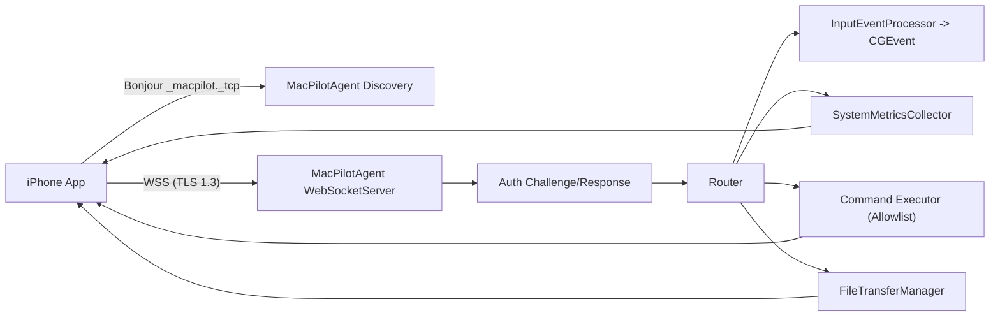

# MacPilot

MacPilot is a multi-target Apple project that lets an iPhone control and monitor a Mac over the local network.

This repository contains the **public architecture and implementation**. Private/internal security protocol documents are intentionally excluded.

## Public Scope

- Included: source code for iOS app, macOS agent, helper app, shared protocol/models, tests, and operational scripts.
- Excluded: private/internal security playbooks and sensitive operational protocols.

## What The System Does

MacPilot provides:

- remote pointer and keyboard input from iPhone to Mac
- system dashboard telemetry (CPU, RAM, Disk, Network, top processes)
- command channel for allowed system actions
- remote file browsing + chunked upload/download
- local network discovery (Bonjour)
- secure connection and device trust bootstrap

## Targets And Responsibilities

| Target | Platform | Responsibility |
|---|---|---|
| `SharedCore` | iOS + macOS | Shared protocol, crypto utilities, models, connection state machine |
| `MacPilotAgent` | macOS | WSS server, authentication, message routing, input/metrics/command/file handlers |
| `MacPilot-iOS` | iOS | Client app UI + live connection, gesture processing, dashboard, shortcuts, files |
| `MacPilotHelper` | macOS | Setup/onboarding UI and permission guidance |
| `MacPilotTests` | macOS tests | Crypto/protocol/model/performance test coverage |

## Project Layout

```text
Sources/
  SharedCore/
    Crypto/                  # Device identity, TLS pinning helpers, session crypto
    DeviceIdentity/          # Pairing and trusted-device store
    Models/                  # Input, metrics, file transfer, device info
    Networking/              # Constants, connection state machine, protocol glue
    Protocol/                # Message envelope and message types

  MacPilotAgent/
    Server/                  # WebSocket server + client session management
    Input/                   # Mouse/keyboard event generation (CGEvent)
    System/                  # CPU/RAM/Disk/Network/process collectors
    FileTransfer/            # Directory browsing + chunked transfer manager
    main.swift               # Runtime bootstrap and central message router

  MacPilotiOS/
    Services/                # Mac connection, Bonjour discovery, gestures, biometrics, transfer service
    ViewModels/              # Trackpad and dashboard logic
    Views/                   # Home, Trackpad, Dashboard, Shortcuts, Files, Settings

  MacPilotHelper/
    Views/                   # Setup flow UI
    Services/                # Permission checker + daemon installer stubs

Tests/
  MacPilotTests/

Scripts/
  start-agent.sh
  stop-agent.sh
```

## End-To-End Runtime Flow



## Network And Protocol Details

### Transport

- WSS over `Network.framework`
- default port: `8443`
- Bonjour type: `_macpilot._tcp`
- app path constant: `/ws`

### Message Model

All messages use `MessageEnvelope` with `MessageType`.

`MessageType` groups:

- Auth/Pairing: `pairRequest`, `pairResponse`, `authChallenge`, `authResponse`, `ephemeralKeyExchange`
- Input: `mouseMove`, `mouseClick`, `mouseScroll`, `keyPress`, `keyRelease`
- Metrics: `metricsRequest`, `metricsResponse`, `processListRequest`, `processListResponse`
- Command: `commandRequest`, `commandResponse`
- File: `fileBrowseRequest`, `fileBrowseResponse`, `fileDownloadRequest`, `fileDownloadChunk`, `fileUploadStart`, `fileUploadChunk`, `fileUploadAck`
- Control: `ping`, `pong`, `error`

### Encoding Pipeline

`SharedCore/Networking/MessageProtocol.swift` supports:

- plaintext envelope encode/decode (`encodePlaintext`, `decodePlaintext`)
- encrypted envelope encode/decode (`encode`, `decode`) using AES-256-GCM via `SessionCrypto`

Current runtime behavior:

- auth and app-level routing in current code path use `encodePlaintext`/`decodePlaintext`
- encrypted envelope pipeline exists and is test-covered, ready to be fully enabled in runtime flow

## Security Model (Public)

### 1) TLS + Certificate Pinning

- Server: generates/loads TLS identity and serves WSS (TLS 1.3 minimum)
- Client: verify block extracts server public key and pins fingerprint (TOFU on first successful connection)
- subsequent connections enforce pinned fingerprint match

### 2) Device Identity + Mutual Signature Handshake

- each device has a P256 signing identity (`DeviceIdentity`)
- handshake:
  1. Mac sends `authChallenge` (`ServerHello`) with random challenge + server identity data
  2. iPhone signs challenge and returns `authResponse` (`AuthRequest`) with its own challenge
  3. Mac verifies client signature and signs client challenge in `AuthResponse`
  4. iPhone verifies server signature and stores trust if needed

### 3) Trusted Device Registry

- trusted peers stored in keychain-backed `TrustedDeviceStore`
- first-seen bootstrap stores peer public key
- later connections enforce key consistency (key mismatch rejected)

### 4) Sensitive Action Controls

- iOS side gates destructive operations with biometrics (`Face ID`/`Touch ID`/`Optic ID` where available)
- agent command channel has allowlist and blocks `runScript` in this build
- destructive commands (`shutdown`, `restart`, `sleep`) additionally require `MACPILOT_ALLOW_DESTRUCTIVE=1` on agent side

## iOS Application: Screen-By-Screen

`MainTabView` always mounts these screens:

- Home
- Trackpad
- Dashboard
- Shortcuts
- Files
- Settings

### Home

- shows connection state from `ConnectionStateMachine`
- starts Bonjour scan (`Scan Network`)
- lists discovered macOS endpoints and triggers connect
- renders brand logo from `BrandLogo` asset

### Trackpad

Trackpad gesture surface maps iPhone gestures to `InputEvent` and sends over connection.

Gesture mapping:

| iPhone Gesture | iOS Event(s) | Agent Action |
|---|---|---|
| 1 finger drag | `mouseMove` | cursor move |
| 1 finger single tap | `leftClick` | left click |
| 1 finger double tap | 2x `leftClick` | double click |
| 2 finger tap | `rightClick` | right click |
| 2 finger double tap | 2x `leftClick` | smart-zoom-like double click |
| 2 finger pan | `scroll` | scroll (with momentum) |
| pinch | `pinchZoom` | zoom simulation |
| 3 finger tap | key combo | macOS Look Up (`Ctrl+Cmd+D`) |
| 3 finger pan | `leftDown` + moves + `leftUp` | drag & drop |
| 4 finger swipe left/right/up/down | key combos | spaces / mission-control style shortcuts |
| 4 finger pinch in/out | key press | launchpad (`F4`) / desktop (`F11`) |

Trackpad tuning features in `TrackpadViewModel`:

- dynamic acceleration based on movement speed
- low-pass smoothing for pointer/scroll
- deadzone filtering
- inertial scroll momentum decay loop

### Dashboard

- requests metrics every `3` seconds (`NetworkConstants.metricsRefreshInterval`)
- renders CPU/RAM/Disk/Network cards and top processes
- updates from `metricsResponse` notifications

### Shortcuts

- sends keyboard shortcuts and media keys
- sends system commands (`shutdown`, `restart`, `sleep`, `lock`, `emptyTrash`, `runScript`)
- uses biometric auth prompt before sensitive actions

### Files

- directory browsing via `fileBrowseRequest`/`fileBrowseResponse`
- file download via chunk stream (`fileDownloadChunk`)
- upload service supports chunked transfer + checksums
- UI list supports navigation, path breadcrumb, refresh

### Settings

- connection status and port display
- mouse/scroll sensitivity controls (`AppStorage` + `GestureEngine` live update)
- haptic toggle
- security summary labels
- identity reset action (clears device identity, cert pins, trusted devices)

## MacPilotAgent Internals

### Server Layer

- `WebSocketServer` listens on `8443`
- Bonjour advertisement service name: `MacPilot`
- single active client model (new client replaces existing)
- keepalive ping/pong via `ClientConnection`

### Message Router (`main.swift`)

Authenticated message dispatch:

- input -> `InputEventProcessor`
- metrics -> `SystemMetricsCollector`
- command -> `executeCommand` allowlist handler
- file browse/download/upload -> `FileTransferManager`
- ping -> pong

Unauthenticated messages are rejected except auth response path.

### Input Pipeline

- `InputEventProcessor` token bucket rate limit: `200 events/s`
- dispatch queue QoS `.userInteractive`
- `MouseController` uses `CGEvent` for move/click/scroll/zoom
- `KeyboardController` uses `CGEvent` for keyDown/keyUp and shortcut helpers
- requires macOS Accessibility permission

### Metrics Pipeline

`SystemMetricsCollector` sources:

- CPU: `host_statistics`
- Memory: `host_statistics64` + swap usage
- Disk: `statfs`
- Network: `getifaddrs`
- Processes: `ProcessMonitor` (`sysctl`, `proc_pidinfo`)

### Command Channel

Allowlisted commands:

- `shutdown`
- `restart`
- `sleep`
- `lock`
- `emptyTrash`

Special behavior:

- `runScript` explicitly disabled in this build
- unknown commands are rejected

### File Pipeline

- browse directory and return `FileItem[]`
- chunk size: `256 KB`
- max file size: `500 MB`
- upload chunk checksum verified before write
- hidden files are skipped during browse

## App Runtime Modes (Dependency Injection)

`AppEnvironment` controls connection backend:

- `.live` -> `RealMacConnection` (`MacConnection`)
- `.demo` -> `MockMacConnection`

Current default is `.live`.

`MockMacConnection` remains in codebase for local demo mode and returns synthetic metrics, command responses, and mock file trees.

## Build, Test, Run

### Requirements

- macOS 14+
- Xcode 16+
- iOS 17+ SDK

### Build Commands

```bash
# macOS targets
xcodebuild build -project MacPilot.xcodeproj -scheme MacPilotAgent -destination 'platform=macOS'
xcodebuild build -project MacPilot.xcodeproj -scheme MacPilotHelper -destination 'platform=macOS'

# iOS target (simulator)
xcodebuild build -project MacPilot.xcodeproj -scheme MacPilot-iOS -destination 'generic/platform=iOS Simulator'

# tests
xcodebuild test -project MacPilot.xcodeproj -scheme MacPilotTests -destination 'platform=macOS'
```

### Start/Stop Agent

```bash
./Scripts/start-agent.sh
./Scripts/stop-agent.sh
```

`start-agent.sh`:

- builds `MacPilotAgent`
- resolves `TARGET_BUILD_DIR`
- checks `8443` availability
- starts the agent with framework paths

### First Run Checklist (Mac + iPhone)

1. Start `MacPilotAgent` on Mac.
2. On Mac, grant Accessibility permission to the process hosting agent (`Terminal` or `Xcode`).
3. Run `MacPilot-iOS` on iPhone or simulator.
4. Accept Local Network permission on iOS.
5. Ensure both devices are on same LAN.
6. In app: `Home -> Scan Network -> select Mac`.

### Test Coverage Snapshot

`MacPilotTests` includes:

- crypto identity and signing verification
- X25519/AES session crypto path
- message envelope/type round-trip checks
- handshake model flow simulation
- constants and serialization tests
- input encoding latency/performance budgets
- file transfer model/checksum/chunk logic tests

### Smoke Test Report

Latest included report:

- `Docs/SMOKE_TEST_2026-03-06.md`
- date: **2026-03-06**
- result: **PASS** for connection, auth handshake, metrics, input, command channel, file browse

## Known Limitations / Open Work

- `MacPilotHelper/Services/DaemonInstaller.swift` methods are scaffolded (`TODO`) and not fully implemented.
- `NetworkRestriction` helper exists but listener path is not yet enforcing it directly.
- Runtime encrypted envelope path (`MessageProtocol.encode/decode`) exists but active message flow currently uses plaintext envelopes.
- `runScript` command intentionally disabled in current build.
- Server currently handles a single active client connection.

## Public Docs

- Architecture summary: `ARCHITECTURE_PUBLIC.md`
- public fix roadmap: `FIX_PLAN.md`

## License

TBD
